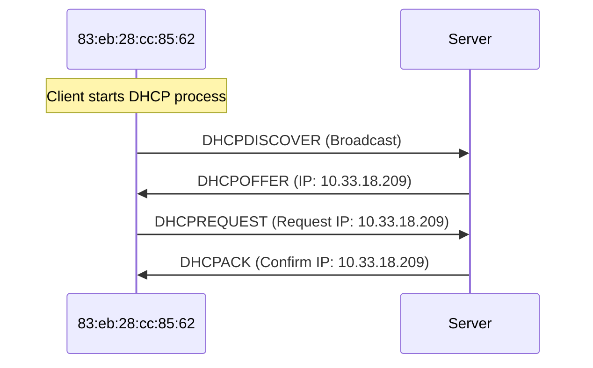

A quick look at the logs suggest a lot of DNS and DHCP packets.

> Here at EI Corp, ethics are our top priority! That's why our IT team was shocked when we got a knock from our ISP informing us that someone on our computer network was involved in some illegitimate activity. Who would do that? Don't they know that's illegal?
>
> Our ISP's knocking (and so is HR), and we need someone to hold accountable. Can you find out who committed this violation?

## Mapping User to Mac

We first associate the usernames (i.e. `1021321935`) with their mac addresses.

```python
log = json.loads(line)
data = log.get('data', {})
if 'username' in data and 'usermac' in data:
	if data['usermac'] in mac_to_user and mac_to_user[data['usermac']] != data['username']:
		print(f"MAC {data['uermac']} has multiple users: {mac_to_user[data['usermac']]} and {data['username']}")
	mac_to_user[data['usermac']] = data['username']
```

## Mapping IP to Mac

Then we associate IP addresses to mac addresses.

```python
if 'opcode' in data and data['opcode'] == 'DHCPACK':
	ip_to_mac[data['ciaddr']] = data['chaddr']
```

### DHCP

DHCP is how a device gets its IP address.



## Log all visits

We log all visited sites from source IP, look up the original username and store the visit history.

If a client requests for DNS on a domain, we can assume they are trying to visit it.

```python
if 'queries' in data:
	user = data['src_ip']
	user = mac_to_user.get(ip_to_mac.get(user, None), user)
	if user not in user_visited:
		user_visited[user] = []
	for query in data['queries']:
		if query['name'] not in user_visited[user]:
			user_visited[user].append(query['name'])
```

## Look for unique visits

Since we are trying to look for one suspicious person, let's search for unique visits.

```python
unique_visits = {}
for user, visited in user_visited.items():
    for item in visited:
        unique_visits[item] = user if item not in unique_visits else None

for item, user in unique_visits.items():
    if user is not None:
        print(f"{user} has a unique visit to {item}")
```

```
1021321935 has a unique visit to copious-amounts-of-illicit-substances-marketplace.com
1021321935 has a unique visit to breachforums.st
1021321935 has a unique visit to smith-wesson.com
1021322261 has a unique visit to bmj.com
10.18.14.190 has a unique visit to welt.de
```

`copious-amounts-of-illicit-substances-marketplace.com` does look very suspicious.
## Filtered logs
The log is filtered such that each suspicious person's logs are to be analysed manually.

```python
for user in set(unique_visits.values()):
    if user is not None:
        mac = next((mac for mac, _user in mac_to_user.items() if _user == user), None)
        print(f"{user} has MAC {mac}")
        ip = next((ip for ip, _mac in ip_to_mac.items() if _mac == mac), None)
        print(f"{user} has IP {ip}")
        if mac is None or ip is None:
            print(f"Cannot find MAC or IP for {user}")
            continue
        sus_lines = []
        with open('logs.json') as f:
            for line in f:
                if user in line or ip in line or mac in line:
                    sus_lines.append(line)
        with open(f"{user}.json", 'w') as f:
            f.writelines(sus_lines)
```

Among all the filtered lines for user `1021321935`, there is one long line with a lot of data stored, and in which indeed we can find username, `llloyd`.

```json
{
    "host": "primary",
    "source": "udp:514",
    "sourcetype": "syslog",
    "_time": "2024-12-04 04:58:36.95",
    "data": {
        "_raw": "...|10.33.18.209|...|llloyd|...",
        "timestamp": "2024-12-04 04:58:35.622504",
        "NLYLeqCZw5xUGKbx1U1158jlnUYRrILtVTtMkMdbA": "..."
    }
}
```

```flag
irisctf{llloyd}
```

```python
import json
mac_to_user = dict()
user_visited = dict()
ip_to_mac = dict()
logs = []
with open('logs.json') as f:
    for line in f:
        log = json.loads(line)
        logs.append(log)
        data = log.get('data', {})

        # store the association between MAC and username
        if 'username' in data and 'usermac' in data:
            if data['usermac'] in mac_to_user and mac_to_user[data['usermac']] != data['username']:
                print(f"MAC {data['uermac']} has multiple users: {mac_to_user[data['usermac']]} and {data['username']}")
            mac_to_user[data['usermac']] = data['username']

        # DHCPACK means the IP is assigned to the MAC
        if 'opcode' in data and data['opcode'] == 'DHCPACK':
            ip_to_mac[data['ciaddr']] = data['chaddr']

        if 'queries' in data:
            user = data['src_ip']
            user = mac_to_user.get(ip_to_mac.get(user, None), user)
            if user not in user_visited:
                user_visited[user] = []
            for query in data['queries']:
                if query['name'] not in user_visited[user]:
                    user_visited[user].append(query['name'])

with open('user_visited.json', 'w') as f:
    json.dump(user_visited, f, indent=4)

unique_visits = {}
for user, visited in user_visited.items():
    for item in visited:
        unique_visits[item] = user if item not in unique_visits else None

for item, user in unique_visits.items():
    if user is not None:
        print(f"{user} has a unique visit to {item}")

for user in set(unique_visits.values()):
    if user is not None:
        mac = next((mac for mac, _user in mac_to_user.items() if _user == user), None)
        print(f"{user} has MAC {mac}")
        ip = next((ip for ip, _mac in ip_to_mac.items() if _mac == mac), None)
        print(f"{user} has IP {ip}")
        if mac is None or ip is None:
            print(f"Cannot find MAC or IP for {user}")
            continue
        sus_lines = []
        with open('logs.json') as f:
            for line in f:
                if user in line or ip in line or mac in line:
                    sus_lines.append(line)
        with open(f"{user}.json", 'w') as f:
            f.writelines(sus_lines)
```
